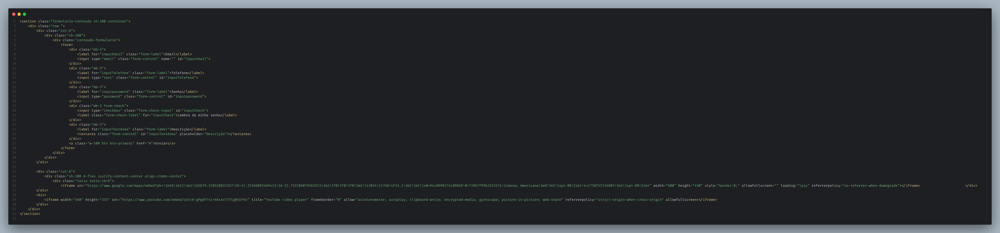

# Iniciativa Bootstrap 

## Projeto loja de roupa - Chinaglia Fashion

Este projeto é um site de moda desenvolvido com HTML5 e Bootstrap 5.3.6. Ele serve como uma base para a criação de páginas modernas, responsivas e visualmente atrativas para o negócio Chinaglia Fashion.

---

## 💻 Meta dados

> Funcionalidades

- Integração com o Bootstrap 5.3.6 para criação de layouts responsivos e componentes prontos.  
- Inclusão de um arquivo de estilo CSS personalizado (style.css) para ajustes de identidade visual.

🔗 [Documentação: Introdução ao Bootstrap 5.3](https://getbootstrap.com/docs/5.3/getting-started/introduction/)

---

## 🧭 Cabeçalho do Site (`<Header>`)

| **Elemento** | **Função** |
|--------------|------------|
| `<header>` | Cabeçalho principal da página |
| `.navbar-brand` | Logo da empresa com link |
| `<nav class="navbar">` | Navegação principal com menu |
| `<ul> > <li> > <a>` | Itens: Início, Novidades, Produtos, Planos, Formulário |
| `.container-botoes` | Botões de Login e Cadastro |
| `.d-flex`, `.justify-content-between`, `.align-items-center` | Flexbox para layout |
| `.bg-light`, `.text-dark`, `.border-bottom` | Estilo claro com borda |

🔗 [Componentes: Navbar](https://getbootstrap.com/docs/5.3/components/navbar/)  
🔗 [Utilitários: Flexbox](https://getbootstrap.com/docs/5.3/utilities/flex/)  
🔗 [Utilitários: Cores e fundo (background)](https://getbootstrap.com/docs/5.3/utilities/colors/)  
🔗 [Utilitários: Texto](https://getbootstrap.com/docs/5.3/utilities/text/)  
🔗 [Utilitários: Bordas](https://getbootstrap.com/docs/5.3/utilities/borders/)

---

## 🎠 Sessão Carrossel

A seção apresenta um carrossel de imagens com destaque visual do site.

🔗 [Componente: Carousel](https://getbootstrap.com/docs/5.3/components/carousel/)

---

## 🧥 Seção "Novidades"

Apresenta um novo produto em layout de duas colunas.

🔗 [Sistema de Grid](https://getbootstrap.com/docs/5.3/layout/grid/)  
🔗 [Utilitários: Espaçamento (margin e padding)](https://getbootstrap.com/docs/5.3/utilities/spacing/)  
🔗 [Utilitários: Alinhamento (texto e vertical)](https://getbootstrap.com/docs/5.3/utilities/text/#text-alignment)  
🔗 [CSS: object-fit (MDN)](https://developer.mozilla.org/pt-BR/docs/Web/CSS/object-fit)  
🔗 [Utilitários: Sizing (largura e altura)](https://getbootstrap.com/docs/5.3/utilities/sizing/)

---

## 🃏 Sessão Card - Produtos

Carrossel com 2 slides contendo 4 produtos cada.

🔗 [Componente: Cards](https://getbootstrap.com/docs/5.3/components/card/)  
🔗 [Carousel com múltiplos itens](https://getbootstrap.com/docs/5.3/components/carousel/#multiple-items)  
🔗 [Utilitários: Display (exibição)](https://getbootstrap.com/docs/5.3/utilities/display/)

---

## 📦 Produtos Exibidos

### Slide 1:
- Blusa Preta Aranha – R$139,90  
- Jaqueta Dark Tech – R$189,90  
- Camiseta Flame Style – R$89,90  
- Calça Baggy – R$159,90  

### Slide 2:
- Camiseta Anjos – R$99,90  
- Camiseta Cruz Tribal – R$94,90  
- Calça Jeans Y2K Wings – R$169,90  
- Camiseta Noite Urbana – R$89,90  

---

## 📊 Seção Tabela de Planos

Tabela comparativa de planos com preços e benefícios.

🔗 [Tabelas no Bootstrap](https://getbootstrap.com/docs/5.3/content/tables/)  
🔗 [Utilitários: Cores e fundo (background e texto)](https://getbootstrap.com/docs/5.3/utilities/colors/)  
🔗 [Utilitários: Bordas](https://getbootstrap.com/docs/5.3/utilities/borders/)

---

## 💼 Planos Disponíveis

| Plano           | Preço     | Benefícios Principais                          |
|-----------------|-----------|------------------------------------------------|
| **Básico**      | R$ 29,90  | Acesso limitado, Suporte por e-mail           |
| **Intermediário** | R$ 59,90  | Acesso total, Suporte prioritário, Backup diário |
| **Premium**     | R$ 99,90  | Suporte 24/7, Todos os recursos, Consultoria  |

---

## 📝 Seção de Formulário + Mapa

Formulário de contato com localização da empresa.

### Formulário:  
Campos utilizados:  
- Email  
- Telefone  
- Senha  
- Checkbox  
- Descrição  
- Botão de envio  

🔗 [Formulários Bootstrap](https://getbootstrap.com/docs/5.3/forms/overview/)  
🔗 [Botões](https://getbootstrap.com/docs/5.3/components/buttons/)  
🔗 [Validação HTML5 (W3Schools)](https://www.w3schools.com/html/html_form_attributes.asp)  
🔗 [Utilitários: Espaçamento (margin e padding)](https://getbootstrap.com/docs/5.3/utilities/spacing/)

### Mapa:  
- Localização via iframe com Google Maps.  
- Responsividade com ratio.

🔗 [Google Maps Embed API](https://developers.google.com/maps/documentation/embed/get-started)  
🔗 [Componente: Ratio](https://getbootstrap.com/docs/5.3/helpers/ratio/)
