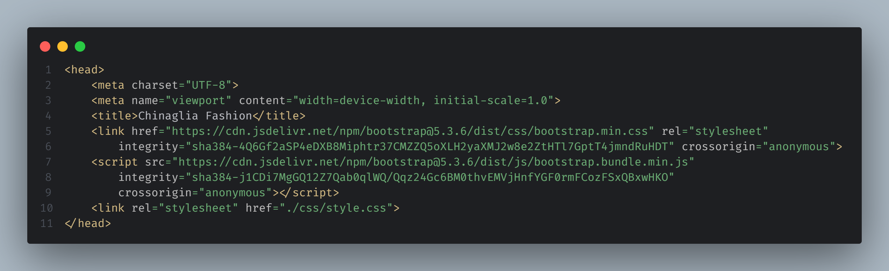
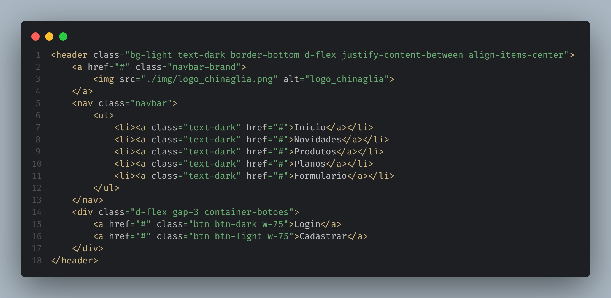
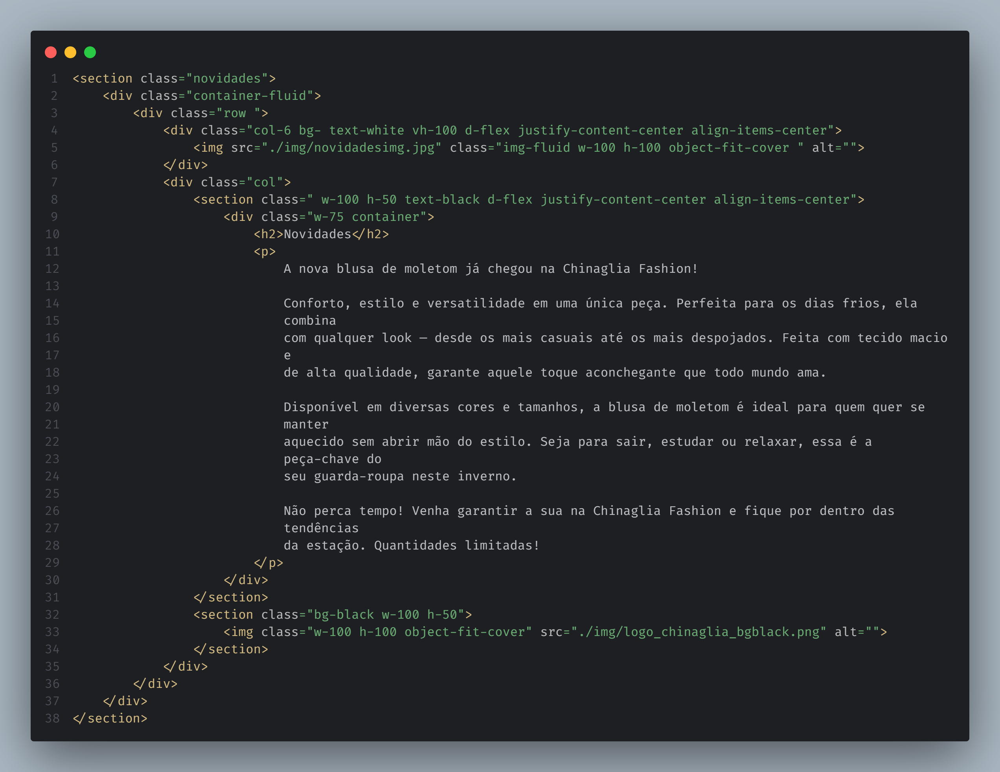
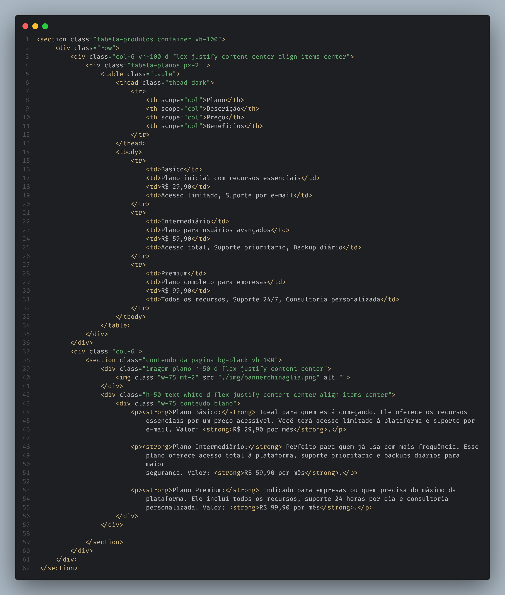

# Iniciativa Bootstrap 

## Projeto loja de roupa - Chinaglia Fashion

Este projeto é um site de moda desenvolvido com HTML5 e Bootstrap 5.3.6. Ele serve como uma base para a criação de páginas modernas, responsivas e visualmente atrativas para o negócio Chinaglia Fashion.

### Visão Geral do código

### 💻 Meta dados

> Funcionalidades

- Integração com o Bootstrap 5.3.6 para criação de layouts responsivos e componentes prontos.

- Inclusão de um arquivo de estilo CSS personalizado (style.css) para ajustes de identidade visual.

### Cabeçalho do Site (`<Header>`)

>Header

| **Elemento**                          | **Função**                                                                 |
|--------------------------------------|----------------------------------------------------------------------------|
| `<header>`                           | Cabeçalho principal da página                                              |
| `.navbar-brand`                      | Logo da empresa com link                                                   |
| `<nav class="navbar">`               | Navegação principal com menu de links                                     |
| `<ul> > <li> > <a>`                  | Itens de menu: Início, Novidades, Produtos, Planos e Formulário           |
| `div.container-botoes`               | Área com botões de Login e Cadastro usando classes do Bootstrap           |
| `.d-flex`, `.justify-content-between`, `.align-items-center` | Layout flexível e alinhamento usando Flexbox do Bootstrap    |
| `.bg-light`, `.text-dark`, `.border-bottom` | Estilização clara com borda inferior                                 |

---

### 🎠 Sessão Carrosel - (`<Section>`)
>section

Este código HTML implementa um **carrossel de imagens** usando os componentes da biblioteca **Bootstrap**, com o objetivo de apresentar banners ou destaques visuais do site da loja **Chinaglia Fashion**.

A seção `carrosel paginas` utiliza o componente `carousel` do Bootstrap com o identificador `carroselExemplo`.

---

### 🧥 Seção "Novidades" – Chinaglia Fashion

Este código HTML implementa uma seção responsiva chamada **"Novidades"** para o site da loja **Chinaglia Fashion**, destacando um novo produto com design moderno e visual atrativo.

### 📐 Estrutura

A seção é composta por duas colunas principais, utilizando o sistema de grid do **Bootstrap**:

### Coluna Esquerda (`col-6`)
- Exibe uma **imagem em destaque** da nova blusa de moletom.
- Classes aplicadas:
  - `vh-100`: altura total da tela.
  - `d-flex justify-content-center align-items-center`: centralização vertical e horizontal.
  - `object-fit-cover`: garante que a imagem cubra todo o espaço sem distorcer.
- Observação: `bg- text-white` parece conter uma classe incompleta (`bg-`).

### Coluna Direita (`col`)
Esta coluna é dividida em duas seções verticais, cada uma ocupando 50% da altura (`h-50`):

#### Parte Superior (Texto)
- Contém:
  - Título: `Novidades`
  - Texto descritivo sobre a blusa de moletom.
- Classes aplicadas:
  - `w-75 container`: limita a largura do texto e aplica espaçamento.
  - `d-flex justify-content-center align-items-center`: centraliza o conteúdo na área.

#### Parte Inferior (Logo)
- Fundo preto (`bg-black`).
- Exibe a imagem do logotipo (`logo_chinaglia_bgblack.png`) com:
  - `w-100 h-100 object-fit-cover`: preenche todo o espaço sem distorcer a imagem.

## 🃏 Sessão Card - Chinaglia Fashion

Esta seção exibe um **carrossel de produtos** com dois slides, cada um apresentando 4 produtos diferentes. É ideal para mostrar lançamentos ou itens em destaque de forma visual e organizada.

---

## 🔧 Estrutura

- `section.produtos`: contém todo o carrossel, com altura total da tela (`vh-100`) e centralização (`d-flex`, `align-items-center`, `justify-content-center`).
- `#carouselProdutos`: carrossel com `data-bs-ride="carousel"` (funcionamento automático).
- `carousel-inner`: contém dois slides (`carousel-item`), cada um com uma linha de 4 produtos (`col-3`).
- Cada produto é exibido dentro de um `figure`, com:
  - Imagem do produto
  - Nome e descrição
  - Preço
  - Botão "Comprar"

---

## 📦 Produtos Exibidos

### Slide 1:
- Blusa Preta Aranha – R$139,90
- Jaqueta Dark Tech – R$189,90
- Camiseta Flame Style – R$89,90
- Calça Baggy – R$159,90

### Slide 2:
- Camiseta Anjos – R$99,90
- Camiseta Cruz Tribal – R$94,90
- Calça Jeans Y2K Wings – R$169,90
- Camiseta Noite Urbana – R$89,90

---

## 📊 Seção Tabela de Planos – Chinaglia Fashion

Esta seção apresenta uma **tabela comparativa de planos** da plataforma, juntamente com uma explicação detalhada e imagem ilustrativa. Ideal para mostrar opções de assinatura ou serviços disponíveis ao cliente.

## Estrutura

A `section.tabela-produtos` é dividida em duas colunas (`col-6`):

### Coluna Esquerda: Tabela de Planos
- Tabela com as seguintes colunas:
  - **Plano** (nome)
  - **Descrição** (resumo)
  - **Preço** (mensal)
  - **Benefícios** (principais recursos)
- Usa o componente `<table>` com a classe `table` do Bootstrap para estilização.

### Coluna Direita: Conteúdo Explicativo
- Imagem ilustrativa (`bannerchinaglia.png`) no topo.
- Textos explicando os planos em detalhes.
- Fundo preto (`bg-black`) com texto branco para contraste.

---

## 💼 Planos Disponíveis

| Plano        | Preço     | Benefícios Principais                          |
|--------------|-----------|------------------------------------------------|
| **Básico**   | R$ 29,90  | Acesso limitado, Suporte por e-mail           |
| **Intermediário** | R$ 59,90  | Acesso total, Suporte prioritário, Backup diário |
| **Premium**  | R$ 99,90  | Suporte 24/7, Todos os recursos, Consultoria  |

---

## 📝 Seção de Formulário + Mapa – Chinaglia Fashion

Esta seção combina um **formulário de contato** com um **mapa interativo**, permitindo que os usuários entrem em contato e visualizem a localização da empresa.

---

## Estrutura

A `section.formulario-conteudo` é dividida em duas colunas (`col-6`), com altura total da tela (`vh-100`):

### Coluna Esquerda: Formulário
Inclui os seguintes campos:
- **Email** (`<input type="email">`)
- **Telefone** (`<input type="text">`)
- **Senha** (`<input type="password">`)
- **Checkbox** para lembrar a senha
- **Descrição** (`<textarea>`)
- **Botão Enviar** (`<a class="btn btn-primary">`)

> **Observação:** O botão de envio está como um link (`<a>`). Idealmente, deve ser um `<button type="submit">`.

### Coluna Direita: Mapa
- Usa um `iframe` com o **Google Maps** embedado, mostrando **Manhattan, Nova York**.
- Responsivo, usando Bootstrap (`ratio ratio-16x9`) para manter a proporção correta do mapa.

---

## 💡 Recursos Utilizados

- Bootstrap 5 (grid, formulário, botões, responsividade)
- Google Maps (embed via `iframe`)

---

## Responsividade

O layout usa `col-6`, o que funciona bem em telas grandes. Para dispositivos móveis, é recomendado adicionar classes como `col-md-6 col-12` para empilhamento vertical.

---

## Melhorias Sugeridas

- Substituir `<a>` por `<button type="submit">` no envio do formulário.
- Adicionar `name` e `action` ao formulário para funcionamento real.
- Validar campos com `required`.

---

## 🌍 Localização no Mapa

O mapa aponta para:

📍 **Senac Americana**

---
